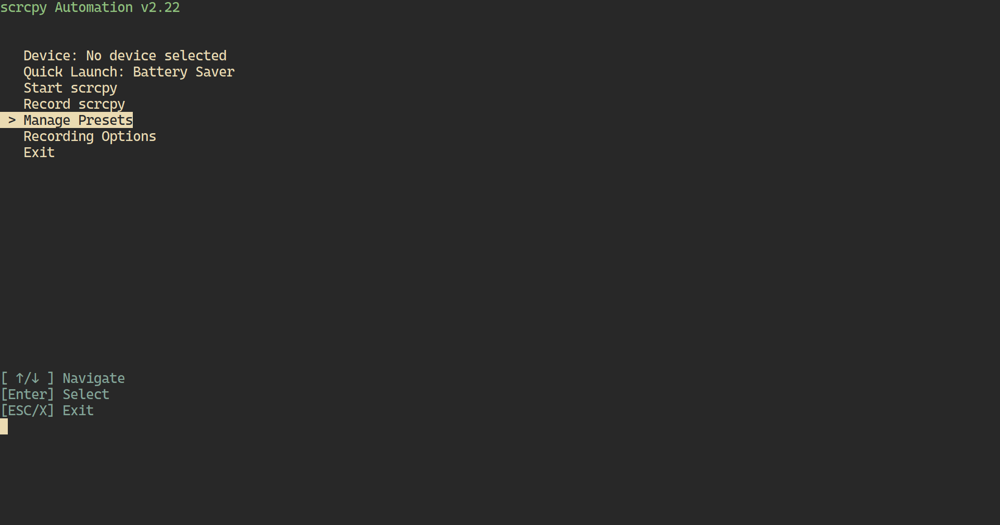
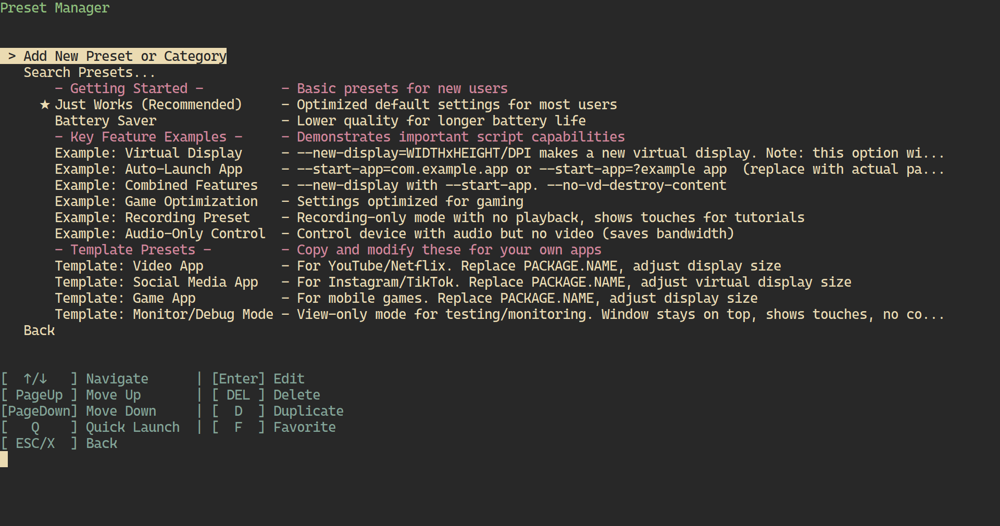

# scrcpy Automation

A PowerShell script that provides a menu-driven interface for managing scrcpy sessions with customizable presets, device selection, and recording capabilities.

## Previews




## Features

- **Interactive Preset Manager**: Easily create, edit, organize, and search scrcpy configuration presets.
- **Device Management**: Seamlessly switch between connected Android devices, with support for USB and wireless connections.
- **Smart Recording**: Record sessions in MKV format with optional automatic remuxing to MP4 (requires FFmpeg).
- **Quick Launch**: Set favorite presets for one-click launching.
- **Flexible Configuration**: Customize resolution, codecs, bitrates, and advanced scrcpy options.
- **Search Functionality**: Quickly find presets using fuzzy matching.
- **Cross-Platform Compatibility**: Designed for Windows with PowerShell 7 or later.

## Requirements

- **PowerShell 7 or Newer**: Ensure you have a modern version of PowerShell installed for full compatibility.
- **scrcpy**: Android screen mirroring tool.
- **ADB (Android Debug Bridge)**: Typically included with scrcpy.
- **FFmpeg**: Optional, for MP4 remuxing.
- **Android Device**: Must have USB debugging enabled.

> **Important**: Older versions of Windows PowerShell (pre-installed with Windows) may not be able to run at all and could display errors. You can download PowerShell 7 from the official PowerShell GitHub page.

## Installation

### 1. Prerequisites

Install the required dependencies using one of the following methods:

#### Using Scoop (Windows)

```powershell
# Install Scoop package manager
Set-ExecutionPolicy RemoteSigned -Scope CurrentUser
irm get.scoop.sh | iex

# Install dependencies
scoop install scrcpy adb ffmpeg
```

#### Using Chocolatey (Windows)

```powershell
# Install Chocolatey package manager
Set-ExecutionPolicy Bypass -Scope Process -Force; [System.Net.ServicePointManager]::SecurityProtocol = [System.Net.ServicePointManager]::SecurityProtocol -bor 3072; iex ((New-Object System.Net.WebClient).DownloadString('https://community.chocolatey.org/install.ps1'))

# Install dependencies
choco install scrcpy adb ffmpeg
```

#### Manual Installation

1. Download and install scrcpy.
2. Download Android Platform Tools (includes ADB).
3. Download and install FFmpeg (optional for MP4 remuxing).
4. Add the installation directories for scrcpy, ADB, and FFmpeg to your system's PATH environment variable.

### 2. Script Installation

1. Download or clone this repository to your local machine.
2. Ensure PowerShell 7 or newer is installed.
3. Navigate to the script directory and run:

   ```powershell
   .\scrcpy-automation.ps1
   ```

## Usage

### Basic Usage

Run the script to access the interactive menu:

```powershell
.\scrcpy-automation.ps1
```

Launch with a specific preset (supports fuzzy matching):

```powershell
.\scrcpy-automation.ps1 -Preset "Low Latency"
```

### Preset Management

The preset manager allows you to:

- Create new presets with custom parameters.
- Organize presets into categories.
- Mark presets as favorites or set them as quick-launch options.
- Search for presets using keywords.
- Duplicate or edit existing presets.

### Recording Features

- Choose between saving recordings as MKV or automatically remuxing to MP4 (Re-encoding audio is needed).
- Specify a custom recording save path.
- Recording parameters are seamlessly integrated with presets.

### Configuration

The script uses a `scrcpy-config.json` file to store:

- Custom presets
- Recording preferences
- Selected device
- Quick-launch settings

This file is automatically created in the script's directory on first run.

## Included Presets

The script includes a variety of pre-configured presets to get you started, feel free to duplicate, edit or remove:

- **Just Works (Recommended)**: Balanced settings for most users.
- **Battery Saver**: Lower quality settings to conserve device battery.
- **Game Optimization**: High-performance settings for gaming.
- **Recording Preset**: Optimized for high-quality recordings with touch indicators.
- **Audio-Only Control**: Control device with audio but no video to save bandwidth.
- **Virtual Display Examples**: Demonstrates virtual display creation with specific apps.
- **Template Presets**: Customizable templates for video, social media, gaming, and debugging.


## Troubleshooting
Refer to the official scrcpy Github documentation: [scrcpy GitHub](https://github.com/Genymobile/scrcpy)

- **PowerShell Version**: Ensure you're using PowerShell 7 or newer to avoid compatibility issues.
- **scrcpy/ADB Not Found**: Verify that scrcpy and ADB are installed and added to your system's PATH.
- **Device Not Detected**: Ensure USB debugging is enabled on your Android device and grant necessary permissions.
- **Wireless Connection Issues**: Confirm that both devices are on the same network and ADB over Wi-Fi is enabled.
- **Recording Errors**: Ensure FFmpeg is installed and added to PATH if using MP4 remuxing.
