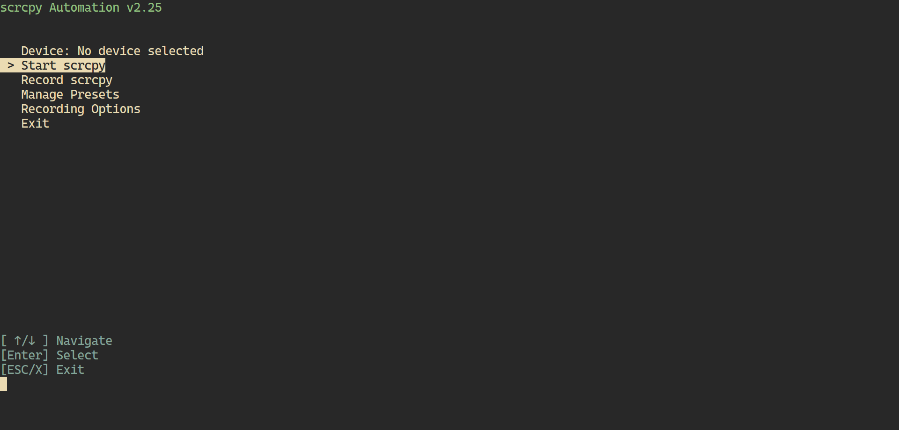
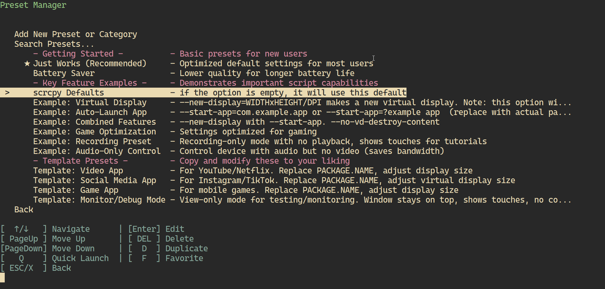

# scrcpy automation

*Pronounced "**scr**een-**c**o**py** automation"*

A PowerShell script that provides a menu-driven text user interface for managing [scrcpy](https://github.com/Genymobile/scrcpy) session with customizable presets, device selection, and recording capabilities.

## Previews




## Table of Contents
- [Quick Start](#quick-start)
- [Features](#features)
- [Requirements](#requirements)
- [Installation](#installation)
- [Usage](#usage)
- [Troubleshooting](#troubleshooting)

## Quick Start
1. Install prerequisites: `scoop install scrcpy adb ffmpeg`
2. Download the script and config file
3. Run: `.\scrcpy-automation.ps1` using PowerShell 7 or later
4. Select a device and preset
5. Enjoy!

## Features

- **Device Management**: Connect to devices using the ADB auto connect feature, connect manually, kill ADB server, and enable ADB over TCP-IP for USB connected device.
- **Preset Manager**: Create, organize, and search scrcpy through configuration presets using a pre-made configurations or you build your own using the preset manager.
- **Modern TUI Interface**: Smooth scrolling for long lists with visual overflow indicators
- **Quick Navigation**: Skip category headings and efficiently browse large preset collections
- **Quick Launch Presets**: Set presets for one-click launching and favorites for visual marks.
- **Preset Configurations**: Customize tags for ease of search, resolution, codecs, bitrates, and other advanced scrcpy options.
- **Convert Recording Format**: Record sessions in MKV format with optional automatic remuxing to MP4 (requires FFmpeg).

## Requirements

- **PowerShell 7 or later**
- **scrcpy**
- **ADB (Android Debug Bridge)**: Typically included with scrcpy.
- **FFmpeg**: Optional, for MP4 remuxing.
- **Android Device**: [USB Debugging must be enabled to use scrcpy](https://github.com/Genymobile/scrcpy?tab=readme-ov-file#prerequisites).

> [!Important]
> Older versions of Windows PowerShell (pre-installed with Windows) may not work and could display errors. You can download PowerShell 7 or later from [the official PowerShell GitHub repository](https://github.com/PowerShell/PowerShell/releases).

## Installation

### 1. Prerequisites

Install the required dependencies using one of the following methods:

#### Using Package Managers (Windows)

Scoop
```powershell
# Install Scoop package manager
Set-ExecutionPolicy RemoteSigned -Scope CurrentUser
irm get.scoop.sh | iex

# Install dependencies
scoop bucket add main
scoop install scrcpy adb ffmpeg
```

or Chocolatey
```powershell
# Install Chocolatey package manager
Set-ExecutionPolicy Bypass -Scope Process -Force; [System.Net.ServicePointManager]::SecurityProtocol = [System.Net.ServicePointManager]::SecurityProtocol -bor 3072; iex ((New-Object System.Net.WebClient).DownloadString('https://community.chocolatey.org/install.ps1'))

# Install dependencies
choco install scrcpy adb ffmpeg
```

#### Manual Installation

1. Download and install scrcpy.
2. Download and install Android Platform Tools (This shouldn't be necessary if you have installed scrcpy properly).
3. Download and install FFmpeg (optional for MP4 remuxing).
4. Add the installation directories for scrcpy, ADB, and FFmpeg to your [system's PATH environment variable.](https://windowsloop.com/how-to-add-to-windows-path/).

### 2. Script Installation

1. Download the `scrcpy-automation.ps1` script and/or the pre-made `scrcpy-config.json` from the [releases page](https://github.com/MNZaidan/scrcpy-automation/releases/latest).
2. Create a new directory for the script and place the downloaded files there.
3. Navigate to the script directory and run it using Powershell 7 in your favorite terminal:

   ```powershell
   .\scrcpy-automation.ps1
   ```

## Usage

### Basic Usage

Run the script to access the interactive menu:

```powershell
.\scrcpy-automation.ps1
```

Launch scrcpy directly with a specific preset without the interactive menu (supports fuzzy matching):

```powershell
.\scrcpy-automation.ps1 -Preset "Low"
# this will match and launch the "Low Latency" preset if available.
# if there are multiple matches, you will be prompted to choose one.
```

### ADB Options

These options are available under the "Select Device" menu.

> [!Note]
> You can use scrcpy via USB connection or wirelessly via ADB pairing or ADB TCP/IP.
> Wireless ADB connections require that your device and computer are on the same network.

- **Auto Connect**: Automatically connect wirelessly to available TCP/IP devices using Get-NetNeighbor or ARP table scan. If these fail, try connecting manually or using pairing.
- **Connect (Manual)**: Connect wirelessly to a device by using its IP address and port.
- **Pair**: Connect wirelessly using a [wireless debugging pairing code](https://developer.android.com/tools/adb#connect-to-a-device-over-wi-fi).
- **TCP-IP**: Enable ADB over TCP/IP for a USB connected device.
- **Kill ADB Server**: Stops the ADB server to resolve connection issues. Any ADB command will restart the server.

### Preset Management

>[!Note]
>You can use the pre-made `scrcpy-config.json` file included in the [releases page](https://github.com/MNZaidan/scrcpy-automation/releases/latest) or create your own from scratch.

- Create new presets with custom parameters.
- Add tags, reorder, duplicate, or edit existing presets.
- Organize presets into categories by using `-` as a prefix and suffix in preset names (e.g., `-Gaming-`, `-Video-`, etc.).
- Mark presets as quick-launch options. These will appear on the main menu for quick access. The last used preset is also available for quick access. Marking favorite will add a star to the preset for ease of identification.
- Search for presets using keywords and tags.
- Navigate long preset lists with smooth scrolling when there are more than 19 items.

### Recording Options

- Choose between saving recordings as MKV or automatically remux to MP4 after recording (Re-encoding audio is needed).
- Specify a custom recording save path.
- Recording parameters are seamlessly integrated with presets.

### Configuration

The script uses a `scrcpy-config.json` file to store:

- Custom presets
- Recording preferences
- Selected device
- Quick-launch preset
- Last used preset

This file is automatically created in the script's directory on the first run if it doesn't exist.

## Troubleshooting
Refer to the [official scrcpy documentation](https://github.com/Genymobile/scrcpy) for more details on scrcpy issues.

- **PowerShell Version**: Ensure you're using PowerShell 7 or later to avoid compatibility issues.
- **scrcpy/ADB Not Found**: Confirm that scrcpy and ADB are installed and added to your [system's PATH](https://windowsloop.com/how-to-add-to-windows-path/).
- **Device Not Detected**: Ensure USB debugging is enabled on your Android device and grant necessary permissions.
- **Wireless Connection Issues**: Verify that both devices are on the same network and [ADB connections are properly configured](https://github.com/MNZaidan/scrcpy-automation?tab=readme-ov-file#ADB-options).
- **Recording Errors**: Ensure FFmpeg is installed and [added to PATH](https://windowsloop.com/how-to-add-to-windows-path/) if using MP4 remuxing.
